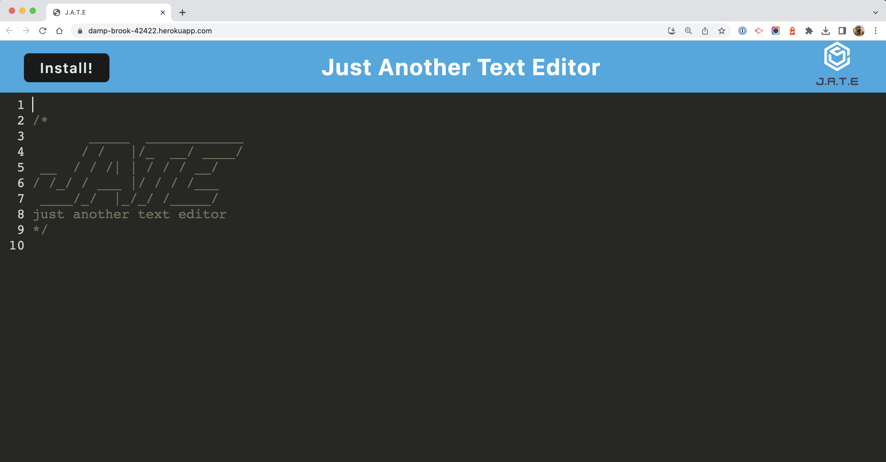
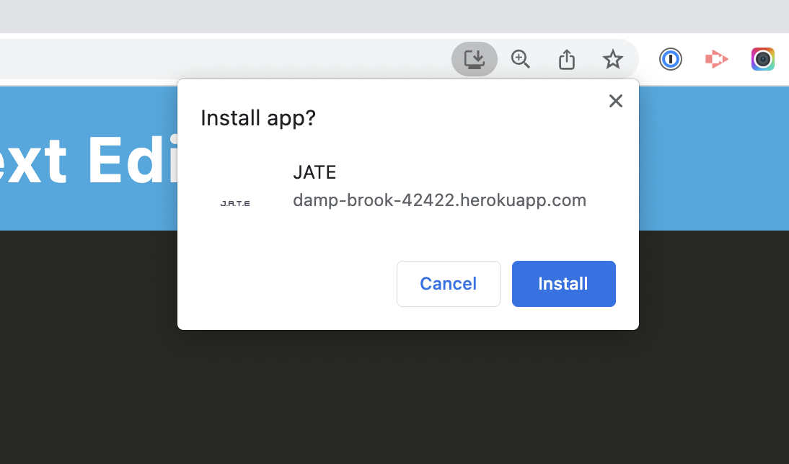
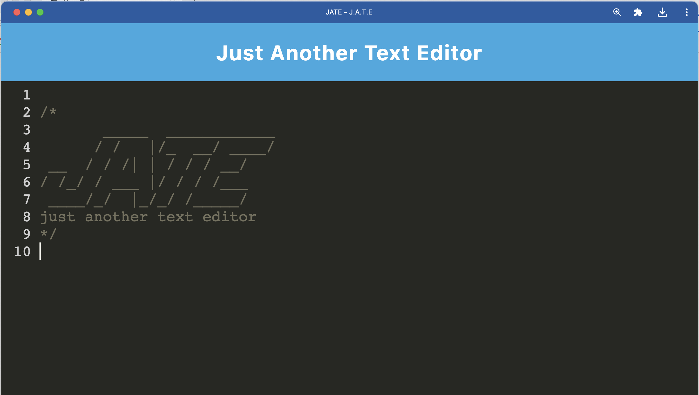
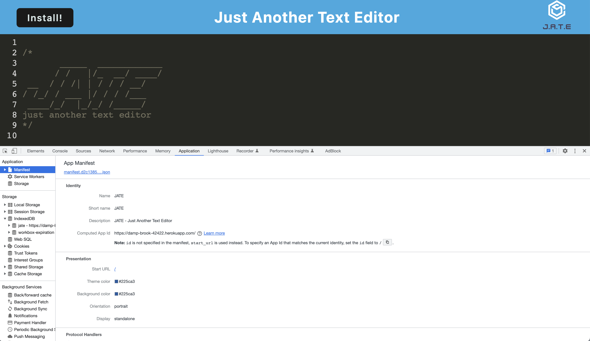
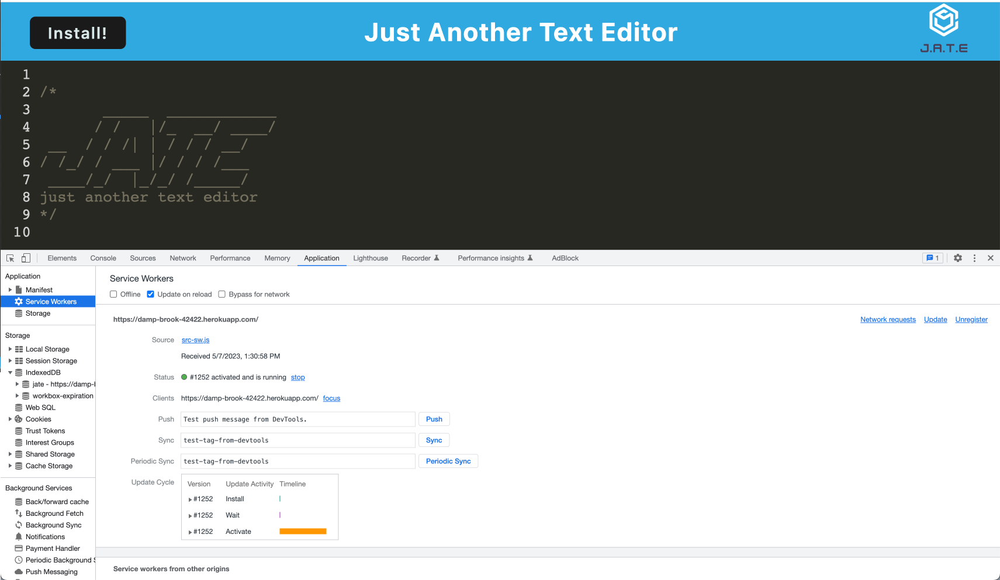
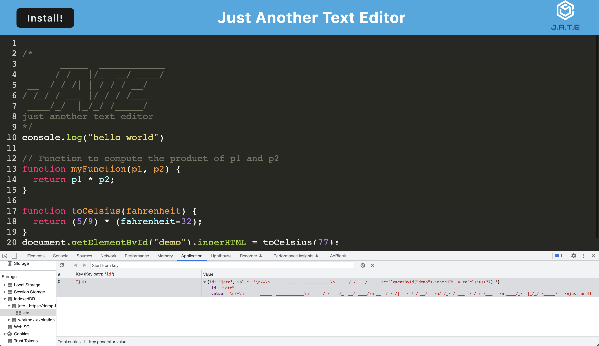

# Text editor

[](https://opensource.org/licenses/MIT)

## Description

I have built a text editor that runs in the browser as a single-page application that also runs offline and can be downloaded as a desktop app. For the database, I used a package called [idb](https://www.npmjs.com/package/idb), which is a tiny library that mostly mirrors the IndexedDB API. I also used [Webpack](https://webpack.js.org/) to bundle the application.

## Table of contents

- [Installation](#installation)
- [Usage](#usage)
- [Deployed application](#deployed-application)
- [Screenshots](#screenshots)
- [Credits](#credits)
- [License](#license)

## Installation

Ensure that you have Node.js installed, v16 is best. You can follow [this](https://coding-boot-camp.github.io/full-stack/nodejs/how-to-install-nodejs) guide for installation instructions.  

Clone this repository:

```bash
git clone git@github.com:sarasg89/subpar-text.git
```

Navigate into the directory where you cloned this repository:  

```bash
cd ./subpar-text
```

Run npm install to retrieve dependencies:  

```bash
npm install
```

## Usage

Open your terminal and navigate to the directory

```bash
cd ./subpar-text
```

Run npm start to initialize the application. This command will build the webpack bundle and start the server.

```bash
npm start
```

Open your browser and navigate to [http://localhost:3001/](http://localhost:3001/) to view the application.

You can enter content into the text editor and it will be saved automatically when you click off of the DOM window. If you close the text editor and reopen it again, the content will still be there. You can also download the application as a desktop app by clicking on the INSTALL icon in the top left corner of the text editor.

The content in the text editor is retrieved from the database even when you are offline. If you are offline and you enter content into the text editor, it will be saved to the database. When you are back online, the content will be retrieved from the database and displayed in the text editor.

## Deployed application

This application has been deployed to Heroku. You can view it here [https://damp-brook-42422.herokuapp.com/](https://damp-brook-42422.herokuapp.com/).

### Screenshots

Text editor:


Install prompt:


Desktop app:


Manifest:


Service worker:


Database:


## Credits

[Starter code](https://github.com/coding-boot-camp/cautious-meme)

This YouTube [tutorial](https://www.youtube.com/watch?v=IZGNcSuwBZs&ab_channel=TraversyMedia) was helpful in understanding how to use Webpack to bundle the application.

This Stackoverflow [thread](https://stackoverflow.com/questions/71278057/heroku-deploy-in-dev-or-production) was helpful in understanding how to deploy to Heroku.

## License

MIT License

Copyright (c) 2023 sarasg89

Permission is hereby granted, free of charge, to any person obtaining a copy of this software and associated documentation files (the "Software"), to deal in the Software without restriction, including without limitation the rights to use, copy, modify, merge, publish, distribute, sublicense, and/or sell copies of the Software, and to permit persons to whom the Software is furnished to do so, subject to the following conditions:

The above copyright notice and this permission notice shall be included in all copies or substantial portions of the Software.

THE SOFTWARE IS PROVIDED "AS IS", WITHOUT WARRANTY OF ANY KIND, EXPRESS OR IMPLIED, INCLUDING BUT NOT LIMITED TO THE WARRANTIES OF MERCHANTABILITY, FITNESS FOR A PARTICULAR PURPOSE AND NONINFRINGEMENT. IN NO EVENT SHALL THE AUTHORS OR COPYRIGHT HOLDERS BE LIABLE FOR ANY CLAIM, DAMAGES OR OTHER LIABILITY, WHETHER IN AN ACTION OF CONTRACT, TORT OR OTHERWISE, ARISING FROM, OUT OF OR IN CONNECTION WITH THE SOFTWARE OR THE USE OR OTHER DEALINGS IN THE SOFTWARE.
